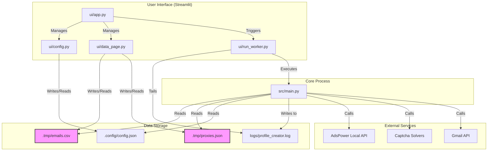

# Architecture & Technology Stack

This document outlines the architectural design and technology choices for the `reddit_profile_creator` project.

## High-Level Architecture

The system is designed as a modular Python application that orchestrates several external services to automate the creation of Reddit profiles securely and robustly. The primary user interface is a Streamlit web application, which provides a user-friendly way to manage configuration, data, and execution.



## Decision Matrix

The following table summarizes the research and rationale for choosing the core components of the technology stack, in accordance with the project's hard constraints.

| Category             | Winner             | Runner(s)-up         | Rationale                                                                                                                                                                                                                                                                                                            |
| :------------------- | :----------------- | :------------------- | :------------------------------------------------------------------------------------------------------------------------------------------------------------------------------------------------------------------------------------------------------------------------------------------------------------------- |
| **Browser Automation** | 🥇 **Zendriver**     | Playwright, Selenium | **Architectural Superiority.** Modern bot detection targets the Chrome DevTools Protocol (CDP). `Zendriver` (a community-driven fork of `Nodriver`) is designed to minimize or eliminate CDP usage, making it fundamentally more stealthy. This directly addresses the "most stealth setup" constraint. It is also actively maintained and has first-class Docker support. |
| **CAPTCHA Service**    | 🥇 **CapSolver**    | 2Captcha             | **Performance & Cost.** `CapSolver` offers modern AI-based solving that is fast (~5s) and significantly cheaper (e.g., ~$0.80/1k reCAPTCHA solves) than human-powered services. Its speed and low cost make it the ideal primary solver for an at-scale creation workflow.                                                        |
| **CAPTCHA Fallback**   | 🥇 **2Captcha**     | N/A                  | **Reliability & Robustness.** If `CapSolver`'s AI fails repeatedly, it signifies a difficult or novel CAPTCHA. Falling back to `2Captcha`'s human-powered service provides a high-accuracy (though slower and more expensive) safety net, ensuring the account creation process can successfully complete.                 |
| **AdsPower API**       | 🥇 **Local API v1**  | Local API v2         | **Sufficiency & Clarity.** The `v1` API is well-documented and provides all necessary functionality for this project, including profile creation with detailed fingerprint and proxy settings. The `v2` API exists, but `v1` is sufficient and directly matches the prompt's reference.                                |
``` 